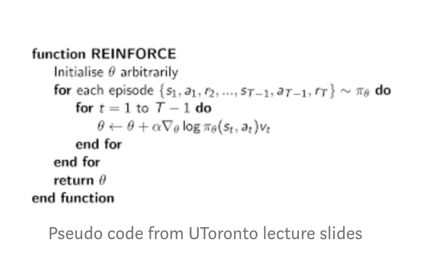

# My REINFORCE implementation as PL system
The separate parts:
- Data module
- Neural Nets
- PL module
- Callbacks
- Data set

## `LunarLander-v2` parameters:
```
MAX_EPOCHS = 700  # maximum epoch to execute
LR = 1e-3  # learning rate
GAMMA = 0.99  # discount factor
```
REINFORCE net:
```
self.net = nn.Sequential(
            nn.Linear(obs_size, 256),
            nn.ReLU(),
            nn.Linear(256, 128),
            nn.ReLU(),
            nn.Linear(128, 128),
            nn.ReLU(),
            nn.Linear(128, n_actions),
        )
```

## `CartPole-v0` parameters:
```
MAX_EPOCHS = 300  # maximum epoch to execute
LR = 1e-3  # learning rate
GAMMA = 0.99  # discount factor
```
REINFORCE net:
```
self.net = nn.Sequential(
            nn.Linear(obs_size, 256),
            nn.ReLU(),
            nn.Linear(256, 128),
            nn.ReLU(),
            nn.Linear(128, 128),
            nn.ReLU(),
            nn.Linear(128, n_actions),
        )
```

## The links to look at (*great thanks to all these people*):

- [REINFORCE+A2C (google colab)](https://colab.research.google.com/github/yfletberliac/rlss-2019/blob/master/labs/DRL.01.REINFORCE%2BA2C.ipynb#scrollTo=aNH3udIuyFgK)
- [DQN example with Pytorch-Lightning (google colab)](https://colab.research.google.com/drive/1F_RNcHzTfFuQf-LeKvSlud6x7jXYkG31#scrollTo=7uQVI-xv9Ddj)
- [REINFORCE implementation from Medium](https://medium.com/@thechrisyoon/deriving-policy-gradients-and-implementing-reinforce-f887949bd63)
- [Quick start with PyTorch Lightning](https://pytorch-lightning.readthedocs.io/en/latest/new-project.html)
- [Actor-Critic Implementation of *higgsfield*](https://github.com/higgsfield/RL-Adventure-2/blob/master/1.actor-critic.ipynb)
- [DRL book - second edition - A2C on a pong game](https://github.com/PacktPublishing/Deep-Reinforcement-Learning-Hands-On-Second-Edition/blob/master/Chapter12/02_pong_a2c.py)


## The flow of REINFORCE algorithm is:

Pseudo Code                 |
--------------------------- |
 |

1. Perform a trajectory roll-out using the current policy
2. Store log probabilities (of policy) and reward values at each step
3. Calculate discounted cumulative future reward at each step
4. Compute policy gradient and update policy parameter
5. Repeat 1–4